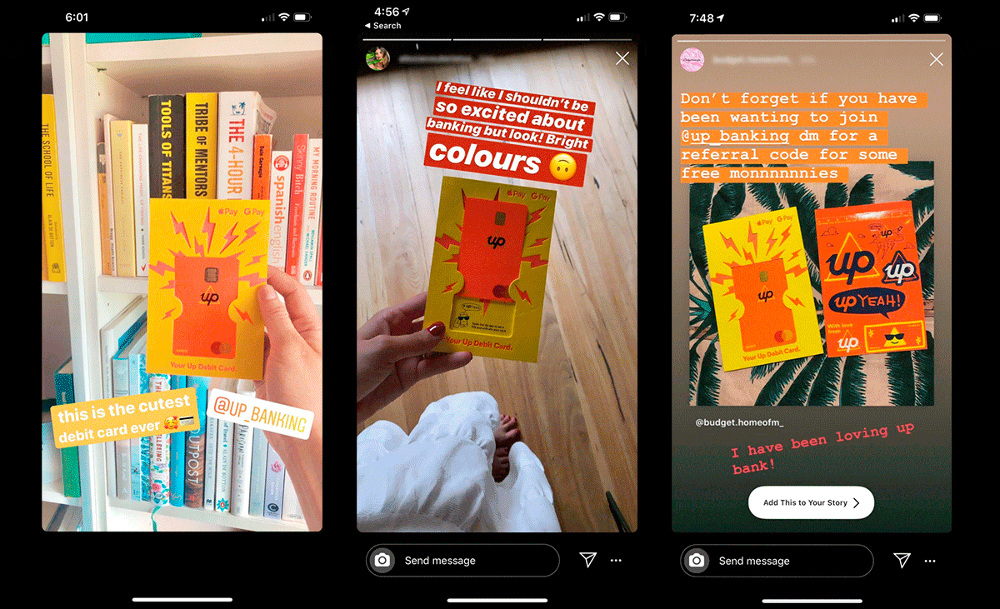

# An Overview of Neobanks and How “Up” is Performing (2021)
<figure>
  
  <figcaption>A picture I took of the Merch Mart, once the largest building in the world.</figcaption>
</figure>

*** *This piece of writing depicts my own personal take on the industry and Up Banking. I make some assertions based on my own experience and research. There may be parts that are incorrect or inaccurate because my perception does not match reality. I would really appreciate constructive feedback or comments to improve.* ***

***Originally written and posted on my Medium in 02/2021***

## The Pandemic
No one has ever thought that a pandemic was coming last year. But, the virus appeared and lives have been pretty different. The whole situation has driven the world's acceleration toward becoming more and more digital. The society has tried to reduce the risk of Covid-19 spread by limiting physical contact (social distancing). This means that less people are allowed to go out and about like we used to. A noticeable example is the closure of physical branches of banks. This would differ amongst different locations, yet Melbourne suffered and has been experiencing this. Especially during the lengthy lockdown last year (2020).

Although one particular group of financial institutions did not really get hurt from this. They are the Neobanks. Up, Judo, 86 400, Volt, and others do not have any physical branch. They only rely on their apps and features to provide support and services to customers/users.

A study by Accenture has estimated that the global payment business (card payments to wiring money overseas) is expected to grow to $2 trillion globally by 2025, but traditional banks are likely to lose out on $280 (~15% of their total payments revenue) due to the appearances of Fintech companies: from payment techs (Stripe, Paypal), Neobanks, to Buy Now Pay Later firms.

This is further evidenced by the thriving Ant Financial of China and ShopeePay of Singapore. Even Gojek (A ride sharing/delivery super app from Indonesia) wanted in as they increased its stake in PT Bank Jago, a Neobank, to 22% from 4%. Once integrated, Gojek users can bank through the app and order in their late night cravings.
An ambitious Neobank in Russia, Tinkoff, also built a super app that includes a partnership with goods.ru to showcase a marketplace offering in its app. It even struck a deal with the current Russian tennis superstar Daniil Medvedev.

## The Exit
Neobanks seemed to be thriving in 2020, until Xinja exited the game late last year.
They blamed both the lack of capital and the lack of lending product. A Xinja spokesman said: "The lending product was mostly held up by lack of capital. Lack of capital to build it and lack of capital to launch it when it was ready."
Another sad news came from another Neobank, 86 400, that was just recently acquired by NAB. This is an even sadder news to those who despise the big 4 banks. Both events challenged the industry and shook the Australian Competition & Consumer Commission as both occurrences help reduce competition and further showed the oligopoly dominance of the big 4 banks.

## What Went Wrong

Unlike traditional banks, Neobanks do not own huge buildings or other big tangible assets. They have their mobile apps. They do have less employees, but their services are also less complicated.
Like other banks, they have to pay their depositors' interest rates, Mastercard/Visa and/or other card issuance fees, wages, and other fees.

Their revenue would come from fees, interchange fees, and interest on loans (lending).
Most neobanks' appeal are the really low or even zero fees. So fees are definitely not their main source of revenue. Interchange fees are money from merchants' accounts whenever their customer makes purchase(s) using a credit/debit card issued by the banks. These fees will not cover their costs.
The last source of revenue is the existence of lending products. However, most Neobanks still rely on funding and capital to drive their operations without properly setting up their steady streams of income. This is not true with Up.

## The UP

"Up is a software application ("Up") provided by Up Money Pty Ltd ACN 624 373 084 ("Up Money"), a subsidiary of Bendigo and Adelaide Bank Limited." This is written on the bottom of Up's website. One of the big hints.
Up is a product of collaboration by a technology company, Ferocia, and a non-big 4 bank, Bendigo and Adelaide Bank. Like other technology companies, Up's approach is user-centric. It tries to understand users' experience and even has a team dedicated to design. Big banks have these too or at least a part of it, but that has not seemed to be translated pretty well into their apps.

Up has been making money by participating in Bendigo's home lending. In other words, Up has been lending out depositors' money for interest. This Neobank does not have to create new products to create revenue streams. It is using its partner, the traditional bank as a tool. It is not at all ideal as this means that even Up is not yet independent. It still relies on other institutions to operate. I do not see this as something truly terrible as many companies and organisations collaborate and help each other to drive profits.

The most integral part for banks are customers and retention, and this is something that Up has been doing well. From customers and retention, banks have deposits and from that point, they have their freedom on how to manage the cash. Deposits usually sit in banks for a long period of time especially when a bank is a person's main bank.
To attract customers, Up has been doing quite a few things right. On top of that, it has a referral program that runs throughout February 2021. A new customer along with his/her friend who referred him/her to Up will receive up to $15 and this is really a really good deal to utilise as new adopters can try it out and even transfer the bonus back to their main bank account if Up is not it. I do have a code if anyone's interested.

According to a survey done by Bain, Consumers prefer and trust technology companies more than traditional banks. This is an opportunity that has to be taken by a company like Up to maximise growth.

---

## What Up has been doing right 
 

### Savings Rate
It does not have the highest saving's rate (ING Savings Maximiser's at 1.3% at the time of writing), but at 1.1 % right now, it is above most other banks'. This is rather attractive and really important as it is one of if not the most important number that a person would look when he/she is considering a new bank.

### Design Thinking

The app itself is highly usable and built with its customers in mind. Every feature is well thought out and navigating through it can be done with ease. Its layout and colours are very easy on the eyes and it even added animations to some of the menus, including the amount of savings and goals we have for each account.

Customer experience has been the focus too as its design decision is based on a framework which would benefit customers most. It has made informed decisions on when to enter passcode/biometrics so that moving around the app would be fast. Only when accessing some more sensitive menus that they will ask for approval. This has definitely reduced friction and the amount of time it takes to do small tasks such as transferring between savings and spending accounts.

When paying, the app also learns and accepts suggestions on the merchants' details so that the next time a user is spending at the same merchant, the proper name including its logo will appear. This is something that has not been done by other banks' app developers. A feature like this is simple enough, yet impactful especially when one tries to remember his/her spending from previous month(s).
<figure>
  
  <figcaption>Saver Pools.</figcaption>
</figure>

There are many other features and included in this nice tree-like structure created by Up. It is actually their roadmap so we can foresee our future with them.

### Neon Orange Card

Their flashy orange card is cool and something a lot of people would post on social media. Up's welcome pack does look great and not at all conventional. The debit card is not sticked inside a folded piece of paper that has been inserted into a regular envelope. It is also the only tangible moment that customers would share with the bank. So they want it to be special. It works and customers share their experience too.

<figure>
  
  <figcaption>Social Media Sharing.</figcaption>
</figure>

### Signing Up is Super Easy
There's no need to fill in ridiculous amount of information and go to a physical location. The process takes about 3 minutes and a user would already created the bank account and can start transferring money into the account. All they want is a driver's license, Medicare card number, or passport number. Nothing else is required other than a few bits to make sure that the KYC process runs smooth.

## What can be better
 

### KYC (Know Your Customer)
Signing up is easy for those who can. I know lots of people including my sister who struggled to proof their eligibility. I am still unsure why, but my sister has tried multiple times and still have not received a proper reason why she could not sign up with Up. Maybe there can be a series of steps to further proof a potential new customer if the usual logic fails.

### Competition and choices
It will be good for the industry and customers if we have choices other than Up and a few others. It will increase competition and further drive innovation. This is a comment directed to the industry and not Up. I do believe that competition will make all the firms better as it would challenge them. I also believe that competition needs to be assisted by regulation and this is where the Australian Competition & Consumer Commission needs to come to play.

### Prove of support
It feels great to see when companies that create products you love can support themselves. This is not usually transparent, but it usually is apparent through the different revenue streams for them. No one would like to see another Xinja as customers would want to stay with banks for an extended period of time. Therefore, users would want to minimise risk and go with a bank with a proven track record and a somewhat more transparent financial support.

---

All in all, Up has been a great example to what will become the next traditional industry of banks. The technology will keep on improving and the conventional options will continue on existing. Maybe, give a Neobank a try and let me know whether you (don't) like it. 