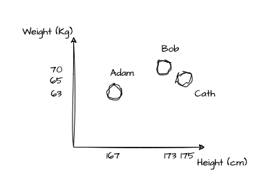
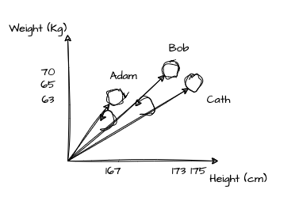

# Simile, Here, and Everywhere (2023)

<figure>
  
  <figcaption>A picture I took of the Merch Mart, once the largest building in the world.</figcaption>
</figure>

*** *This piece of writing presents my own personal perspective on this topic. I make some assertions based on my own experience and research. There may be parts that are incorrect or inaccurate. I would really appreciate constructive feedback or comments to enhance it.* ***

***Originally written and posted on my Medium in 08/2023***

## Introduction
From word association tests to daily conversations to compare and contrast English papers, humans love and are really good at making comparisons. Just look at how often we use the word “like” and how we compare a situation to another. Or rather fancier, how literary devices like similes and metaphors are used extensively in books & poems across various languages.

The idea for this medium text came about when a musician friend was asking me for feedback about a new song. When listening to that particular song for the first time, I could not help but notice how similar the intro section was to some other songs. So that was exactly what I wrote about for the intro. How this new song reminded me of not only other songs, but also other artists. The term “reminded” comes to play because I could not explain what sort of “features” were similar. Whether it was the chord progression, the rhythm section, the chosen instruments, the mix, or the bass line. It was most likely a combination of some and many of them.

In the following sections, I will try to lay out what I think about similarity and how different field of studies have been trying to quantify and make use of it.

## Similarity As a Measure of Distance
We can imagine a simple number line representing just one dimension. Let’s say it’s for a person’s height in cm. The closeness of points on this line indicates their degree of similarity. When two things are close together, they share not so apart values of that feature (how tall they are). Hence, they are similar in height.

<figure>
  
  <figcaption></figcaption>
</figure>

By analysing the data through this one-dimensional lens, we can gain valuable insights and group objects based on their similarities, even when working with only one dimension.

Just as in everyday life we often rely on norms and standards to gauge various aspects, mathematics introduces its own set of norms that serve as fundamental measures of distance. These norms provide us with consistent criteria to evaluate the extent of difference between points in a space. For instance, the absolute value can be seen as a norm that quantifies the distance between two values along a linear scale. Another noteworthy norm is the squared difference, also called Euclidean distance, a well-known concept particularly significant in higher dimensions. This distance metric encapsulates the straight-line distance between points. These norms not only establish mathematical benchmarks for assessing proximity but also form the cornerstone for various mathematical and computational applications.

## The Second Dimension
When comparing multiple objects, we are more likely to observe more than one features or dimensions. Continuing on the previous example, a second metric we can look at is a person’s weight. We know for sure that every single person is unique, but we can simplify the complexities of different people by leveraging something we can measure. Depending on the objectives, we can make use of these two measurements : weight and height. Think about designing T-shirt sizes.

Let’s now plot our points in a 2-dimensional space.

<figure>
  
  <figcaption></figcaption>
</figure>

Now what? We can see that one is closer to another (Bob and Cath are closer than that of Adam and Cath), but we do need a number to “quantify” this. One thing I’ve learned throughout the years is the desire for us humans to quantify different things. We tend to forget some potential biases, such as the “anchoring effect”, where humans thoughts would depend on a particular “anchor”. I do see this “similar” to the concept of that of the Bayes’ Theorem (when an information about something is based on prior knowledge of that thing), but maybe let’s cover this in another time.

Now that we have the points, think about what we can do and how the values of the features help map out where they lie. We can just use distance between the points, but when we have many points with a huge range, such measure would become trivial. We can maybe pull lines from the origin and make what we call vectors (lines with directions). These vectors would contain information of both features (weight and height) and between them, we can measure the angle!

<figure>
  
  <figcaption></figcaption>
</figure>

## The Angular Distance
A nice property of angles is that it has a fix range. With a little algebra on the below, we can get what we usually call the cosine similarity — also a very cool measure of similarity. This involves the dot product and normalisation by the length of each vector. Cosine values also range between -1 and 1, and the smaller the angle (x) the higher cos x will be. Hence, similar points or people in our context would have higher cos x values between them.

<figure>
  
  <figcaption></figcaption>
</figure>

## The Dot Product
Now, let’s go off on a tangent and explore why the above calculation involves the dot product. Also known as the scalar product or inner product, the dot product is a mathematical operation that takes two vectors and produces a single scalar value. It’s a way to measure the alignment between two vectors in a multidimensional space. Another way to think about it is by pairing out one vector and apply a matrix multiplication with the other vector transposed as some sort of a linear transformation. We will achieve the same scalar value using equivalent calculation steps as the dot product. This understanding is also often referred to mapping and projection. I really enjoyed this duality explanation here.

Going back to our example, we can make sense of this in a way that for each feature / dimension, we are trying to find out how much of a person’s height and weight is part of the other person’s. Then we sum them up.

An even furhter tangent is how this is also actually covariance and correlation. Here’s a great definition by Oliver Knill (2011),

<em>"If X, Y are two random variables of zero mean, then the covariance Cov[XY ] = E[ X · Y ] is the dot product of X and Y . The standard deviation of X is the length of X. The correlation is the cosine of the angle between the two vectors. Positive correlation means an acute angle, negative correlation means an obtuse angle. Uncorrelated means orthogonal."</em>

Let’s tackle more about correlation in another post.

## Use it Everywhere
Now that we know more about similarity measures, we can extend our understanding and how they’re being used for different applications:
1. __Clustering__: Similarity measures are fundamental in clustering algorithms, such as k-means and hierarchical clustering. They help group similar data points together.
2. __Anomaly Detection__: In anomaly detection, similarity measures can identify data points that deviate significantly from a group(s). Unusual patterns or outliers are often detected by measuring their dissimilarity from the rest of the data.
3. __Collaborative Filtering__: In recommendation systems, collaborative filtering relies on measuring the similarity between users or items based on their preferences. This helps suggest items or content to users based on what similar users have liked.
4. __Machine Translation__: Similarity measures are employed in machine translation to align and compare sentences or phrases in different languages to improve translation quality.
5. __Dimensionality Reduction__: Similarity measures are often used as a foundation for dimensionality reduction techniques like the PCA (Principal Component Analysis).

These examples highlight the broad range of applications where similarity measures find utility across diverse domains. Similarity measures assist in understanding complex relationships and play a significant role in decision-making and analysing diverse subjects. But sometimes, it is easier to compare objects qualitatively. Maybe we can build a fine-tuned large language model that focuses on qualitative comparison.

--- 
Hope this can be interesting to some. Do let me know if I can further improve this.