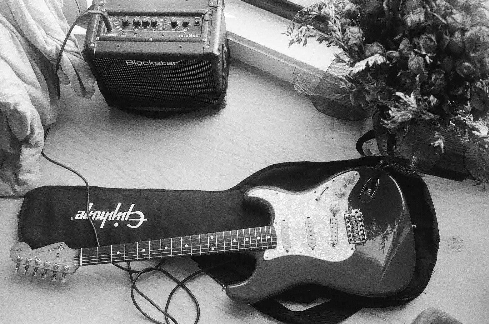
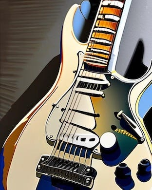

# Data Reduction through Dynamic Range & Compression (2023)

<figure>
  
  <figcaption>My old Guitar on Ilford HP5</figcaption>
</figure>

*** *This piece of writing presents my own personal perspective on this topic. I make some assertions based on my own experience and research. There may be parts that are incorrect or inaccurate. I would really appreciate constructive feedback or comments to enhance it.* ***

***Originally written and posted on my Medium in 10/2023***

## Introduction
In such a digitalised world, we are blessed with technological advancements that enable us to effortlessly capture and immortalise our most cherished memories. The mere notion of not being able to snap a quick picturdate or record any thought in an audio clip is unthinkable. I rely very much on such tools to be able to share and take note of ideas. Though, I do try to refrain from them to be in the "moment" at times.

I was tinkering around with my old camera when I encountered a term I was more familiar with some time ago when I was more into photography. It was the dynamic range option. There's this little box in the main options to choose between different levels of dynamic ranges. I played around, but could not really the difference; With curiosity piqued, to Google I ventured.

In this article, we will get a little technical and traverse the landscape of dynamic range, compression, and some sort of data reduction.

## Unveiling the Dynamic Range
In the realm of both audio and photography, dynamic range refers to the span between the quietest and loudest elements of a recording or an image. It's what adds that touch of realness, the extra little details, whether you're hearing a soft, gentle whisper in an audio clip or witnessing those subtle shifts from light to shadow in a photograph. The best processor is still our own eyes and ears, as they capture most of the intricacies of the ranges of the colour and sound wave spectrum. Not just because of the range that we can take in, but how they feel when it's real. You probably have real experiences trying to record a video under low light with some over exposures of light throwing off the balance.

Dynamic range is also a versatile tool that can transport you to the heart of a symphony, where the transition from a whispering double bass to a roaring flute mirrors an epic. As a tool, the dynamic range really works as a highlighter, and it's really up to us humans to choose what to show off.

One might also wonder how such control can be done in real time, and in the guitarists' world, we have pedals. Those small stomp boxes ready to be pressed to change the overall "tone" of your guitar. Next time you're going to a venue with live music, make sure to keep an eye on the guitarist's feet. One of those pedals is called an eq pedal. Also referred as an equaliser, it is a much welcomed box to a musician's arsenal. The audio frequencies that we hear sit across a certain spectrum, of which the human ear can hear between 20Hz to 20kHz. In the most basic terms, an EQ pedal allows you to cut (decrease) or boost (increase) the frequencies already inherent and present in the guitar tone.

## Enter Compression

<figure>
  
  <figcaption></figcaption>
</figure>

Dynamic range, captivating as it is, comes hand in hand with another significant concept: compression. Just as we aim to strike a balance between being immersed in the moment and capturing it digitally, compression serves a similar purpose. In audio, compression maintains a consistent volume level throughout a recording, while in the visual realm, image compression strives to retain quality while shrinking file sizes for efficient storage and sharing.

Think of compression as the conductor of an orchestra, ensuring that no instrument drowns out the others, just as no element in an image or audio recording is lost in the pursuit of efficiency. It's the science of finding equilibrium between the greatness of a full orchestra and the limitations of a compact bedside speaker.

<figure>
  
  <figcaption></figcaption>
</figure>

As shown by the above diagram, a signal's amplitude can be limited to the dotted line only as we take away the highest highs and the lowest lows to maintain the balance of what we want to actually convey as creators. This is usually done behind the scenes as to capture the most information with the least amount of storage. We also often compress our digital documents and zip them to make them smaller in size. Or similar concept to a statistical model in which we choose only the most important features.

## Data Reduction and Singular Value Decomposition

In the sprawling landscape of digital information, where vast data streams flow ceaselessly, the concept of data reduction emerges as important as ever to cater efficiency and clarity. Imagine a way to distil overwhelming amounts of data into more digestible and meaningful forms, preserving its meaning while reducing its complexity. Within this realm of data transformation, there is a powerful and popular technique known as Singular Value Decomposition (SVD).
SVD, although a technical term, carries profound implications for understanding the hidden intricacies of data patterns. SVD breaks down a dataset into its core elements, exposing the fundamental components that shape its behaviour and showing off its important features.
Consider a puzzle made up of distinct pieces that interlock seamlessly, forming a larger picture. Similarly, SVD deconstructs a dataset, laying its elements bare that define its behaviour. It's like observing the distinct ingredients that meld together to form a dish.

<figure>
  
  <figcaption></figcaption>
</figure>

After an internal dialogue, I have decided to share a little bit of those puzzle pieces.

<figure>
  
  <figcaption></figcaption>
</figure>

__A__ is a matrix or a dataset with rows as your observations and columns as your features.

__B__ captures the relationships and patterns among the rows of the original matrix.

__C__ consists of values that tell us how significant each pattern or direction is.

__D__ captures the patterns among the columns of the original matrix.

The way SVD is used as a data or dimension reduction tool can be somewhat intuitive. By reducing the data's dimensions, SVD simplifies the intricate web of information while retaining its essence. This technique finds its applications across a spectrum of fields, from image and audio processing to recommendation systems.

## Conclusion
In this age of information abundance, the ability to harness the power of data lies at our fingertips. We find ourselves standing at the intersection of art and technology, where data reduction techniques such as Singular Value Decomposition (SVD) bridge the gap between complexity and clarity.

How much reduction and changes are needed depends on context and the objective. One could be like Christopher Nolan who still shoots Oppenheimer on 70mm IMAX film which he claims can "get a feeling of 3D without the glasses". Although I haven't had the chance to witness it, it's a testament to his commitment to the art of moving pictures.

On the other hand, consider a drummer by the name of Louis Cole. He recorded some of his parts with an iPhone, relying on automatic compression and other processing. It's a choice driven by convenience and perhaps a desire for a unique sound.

Ultimately, it's up to you.