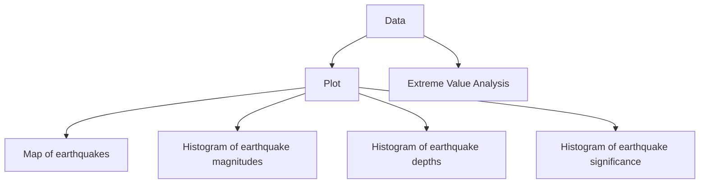

# Earthquakes and Extreme Values

Recently, Taiwan experienced a massive earthquake that sent shockwaves through the region, leaving devastation in its wake. The tremors struck with alarming intensity, shaking buildings, disrupting infrastructure, and instilling fear among residents. Such seismic events serve as stark reminders of the unpredictable forces of nature and the vulnerability of human civilization in the face of natural disasters.

In the aftermath of this earthquake, questions arise about the frequency of such severe events. While earthquakes are not uncommon in Taiwan due to its location within the notorious "Ring of Fire," where tectonic plates meet and seismic activity is heightened, the occurrence of a major quake of this magnitude raises concerns about the region's preparedness and resilience.

These occurrences serve as potent reminders of the unpredictable forces of nature and the necessity of understanding and preparing for extreme events. Exploring extreme value theories, such as the Generalized Pareto Distribution (GPD), provides valuable insights into the probability distribution of earthquakes and aids in risk assessment and disaster mitigation efforts.

This page delves into the analysis of earthquake data to understand the distribution of seismic events and assess the risk of extreme earthquakes. By examining historical earthquake records and applying extreme value analysis techniques, we aim to gain insights into the likelihood and impact of future seismic events. The interactive visualizations and statistical analyses presented here offer a comprehensive view of earthquake dynamics and the potential risks associated with extreme seismic events.


## Here's a mermaid diagram of the page flow


## Map of past Earthquakes
Plotting the map of earthquakes around the globe from 2001 to 2024 reveals the prevalence of seismic activity along the Ring of Fire. This area, encircling the Pacific Ocean basin, is known for frequent earthquakes and volcanic eruptions due to the dynamic movement of tectonic plates. The map illustrates the clustering of seismic events along tectonic boundaries, emphasizing the heightened risk faced by countries bordering the Pacific Rim.

```js
import * as Plot from "npm:@observablehq/plot";
import {format} from "npm:d3";
```


```js
const earthquake = FileAttachment("data/earthquake_1995-2023.csv").csv({typed: true});
const land50m = FileAttachment("data/land-50m.json").json()
```
```js
const earthquake_above = FileAttachment("data/above_811.csv").csv({typed: true});
```

```js
const land = topojson.feature(land50m, land50m.objects.land)
```

```js echo
Inputs.table(earthquake)
```


```js echo
Plot.plot({
  title: "Records of 782 earthquakes from 1/1/2001 to 1/1/2023",
  width: 960,
  height: 500,
  projection: "equirectangular",
  r: { range: [1, 6] },
  color: {
    domain: ["yellow", "orange", "red", "green"],
    range: ["yellow", "orange", "red", "green"],
    legend: true
  },
  marks: [
    Plot.geo(land, { fill: "#000", fillOpacity: 0.4 }),
    //Plot.graticule(),
    //Plot.sphere(),
    Plot.dot(earthquake, {
      x: "longitude",
      y: "latitude",
      symbol: "triangle2",
      r: "sig",
      fill: "alert",
      channels: {
        Magnitude: "magnitude",
        Location: "location",
        Significance: "sig",
        Alert: "alert",
      },
      tip: {
        format: {
          Magnitude: true,
          Location: true,
          Significance: true,
          y: false,
          x: false,
          r: false,
          stroke: false,
          fill: false
        }
      }
    })
  ]
})
```

## Histogram Analysis
Examining histograms of earthquake magnitudes, depths, and significance showcases the distribution of seismic events over time. Remarkably, the shape of these histograms often mirrors that of the Generalized Pareto Distribution. This similarity underscores the utility of extreme value theories in modeling and predicting seismic events. Histogram analysis allows researchers to identify trends in earthquake frequency and magnitude, providing essential data for risk assessment and disaster management strategies.

```js echo
Plot.plot({
  title: "Histogram of earthquake magnitudes",
  marks: [
    Plot.rectY(earthquake, Plot.binX({ y: "count" }, { x: "magnitude", fill: "#cc0000" })),
    Plot.ruleY([0])
  ]
})
```

```js echo
Plot.plot({
  title: "Histogram of earthquake depths",
  marks: [
    Plot.rectY(earthquake, Plot.binX({ y: "count" }, { x: "depth", fill: "#964B00" })),
    Plot.ruleY([0])
  ]
})
```

```js echo
Plot.plot({
  title: "Histogram of earthquake significance",
  marks: [
    Plot.rectY(earthquake, Plot.binX({ y: "count" }, { x: "sig", fill: "#088F8F	" })),
    Plot.ruleY([0])
  ]
})
```
## Peak Over Threshold (POT) Analysis
In addition to the Generalized Pareto Distribution (GPD), Peak Over Threshold (POT) analysis is a powerful method for studying extreme events like earthquakes. Unlike traditional methods that consider all events, POT analysis focuses specifically on events exceeding a chosen threshold. This approach is particularly useful when dealing with rare and extreme events, as it allows for more accurate estimation of the tail of the distribution.

In POT analysis, only the peaks of events surpassing the threshold are considered, enabling a more precise modeling of extreme values. By fitting these exceedances to a GPD, researchers can gain insights into the probability of extreme events occurring beyond the threshold. This not only provides a better understanding of the tail behavior of the distribution but also facilitates more effective risk assessment and mitigation strategies.

Moreover, POT analysis allows for the estimation of parameters such as the shape (xi) and scale (beta) of the GPD, which are essential for characterizing the distribution of extreme events. These parameters help quantify the likelihood and severity of future earthquakes, providing valuable information for infrastructure planning, building codes, and emergency response preparedness.

```r
# Extreme Value Analysis in R
u = quantile(earthquake$magnitude, 0.95) # 7.8 is the 95th percentile

# Fit GPD by Probability Weighted Moments
fit_gpd = gpdFit(earthquake$magnitude, u = u, type = 'pwm', information = c("observed", "expected"))

gpdRiskMeasures(fit_gpd,c(0.95,0.99,0.999))
```

## Interpreting Expected Shortfall:
Interpreting the expected shortfall for various probabilities, such as 95%, 99%, and 99.9%, provides critical information for risk management. Expected shortfall represents the average magnitude of seismic events beyond a certain threshold, offering insight into the potential severity of damages. For instance, the estimated values suggest that seismic events exceeding a magnitude of 7.77 occur with a 5% probability. At the 95th percentile (quantile), seismic events surpassing this threshold (with a magnitude of 7.77) are expected to result in magnitudes averaging over 8.11. This insight underscores the imperative of implementing robust infrastructure and emergency response measures to mitigate the impact of such events on communities and economies.

p          | quantile     | shortfall
---------- | ------------ | ----------
0.950      |  7.771814    | 8.116149
0.990      |  8.343712    | 8.543970
0.999      |  8.772562    | 8.864781


## Massive Earthquakes in the past above 8.1
```js
Inputs.table(earthquake_above)
```

Data: Chirag Chaunan, [here](https://www.kaggle.com/datasets/warcoder/earthquake-dataset)
