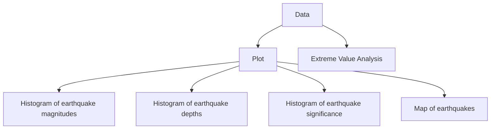

# Earthquakes and Extreme Values



```js
import * as Plot from "npm:@observablehq/plot";
import {format} from "npm:d3";
```

```js
const earthquake = FileAttachment("data/earthquake_1995-2023.csv").csv({typed: true});
const land50m = FileAttachment("data/land-50m.json").json()
```

```js
const land = topojson.feature(land50m, land50m.objects.land)
```

```js echo
Inputs.table(earthquake)
```

```js echo
Plot.plot({
  title: "Records of 782 earthquakes from 1/1/2001 to 1/1/2023",
  width: 960,
  height: 500,
  projection: "equirectangular",
  r: { range: [1, 6] },
  color: {
    domain: ["yellow", "orange", "red", "green"],
    range: ["yellow", "orange", "red", "green"],
    legend: true
  },
  marks: [
    Plot.geo(land, { fill: "#000", fillOpacity: 0.4 }),
    //Plot.graticule(),
    //Plot.sphere(),
    Plot.dot(earthquake, {
      x: "longitude",
      y: "latitude",
      symbol: "triangle2",
      r: "sig",
      fill: "alert",
      channels: {
        Magnitude: "magnitude",
        Location: "location",
        Significance: "sig",
        Alert: "alert",
      },
      tip: {
        format: {
          Magnitude: true,
          Location: true,
          Significance: true,
          y: false,
          x: false,
          r: false,
          stroke: false,
          fill: false
        }
      }
    })
  ]
})
```


```js echo
Plot.plot({
  title: "Histogram of earthquake magnitudes",
  marks: [
    Plot.rectY(earthquake, Plot.binX({ y: "count" }, { x: "magnitude", fill: "#cc0000" })),
    Plot.ruleY([0])
  ]
})
```

```js echo
Plot.plot({
  title: "Histogram of earthquake depths",
  marks: [
    Plot.rectY(earthquake, Plot.binX({ y: "count" }, { x: "depth", fill: "#964B00" })),
    Plot.ruleY([0])
  ]
})
```

```js echo
Plot.plot({
  title: "Histogram of earthquake significance",
  marks: [
    Plot.rectY(earthquake, Plot.binX({ y: "count" }, { x: "sig", fill: "#088F8F	" })),
    Plot.ruleY([0])
  ]
})
```

```r
# Extreme Value Analysis in R
u = quantile(earthquake$magnitude, 0.95) # 7.8 is the 95th percentile

# Fit GPD by Probability Weighted Moments
fit_gpd = gpdFit(earthquake$magnitude, u = u, type = 'pwm', information = c("observed", "expected"))

gpdRiskMeasures(fit_gpd,c(0.95,0.99,0.999))
```


p          | quantile     | shortfall
---------- | ------------ | ----------
0.950      |  7.771814    | 8.116149
0.990      |  8.343712    | 8.543970
0.999      |  8.772562    | 8.864781
