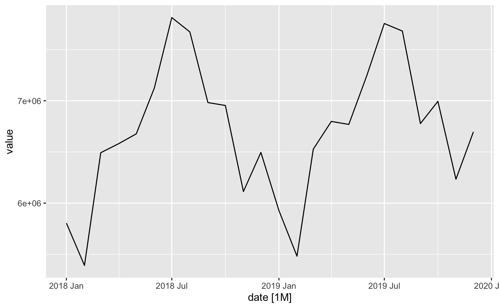
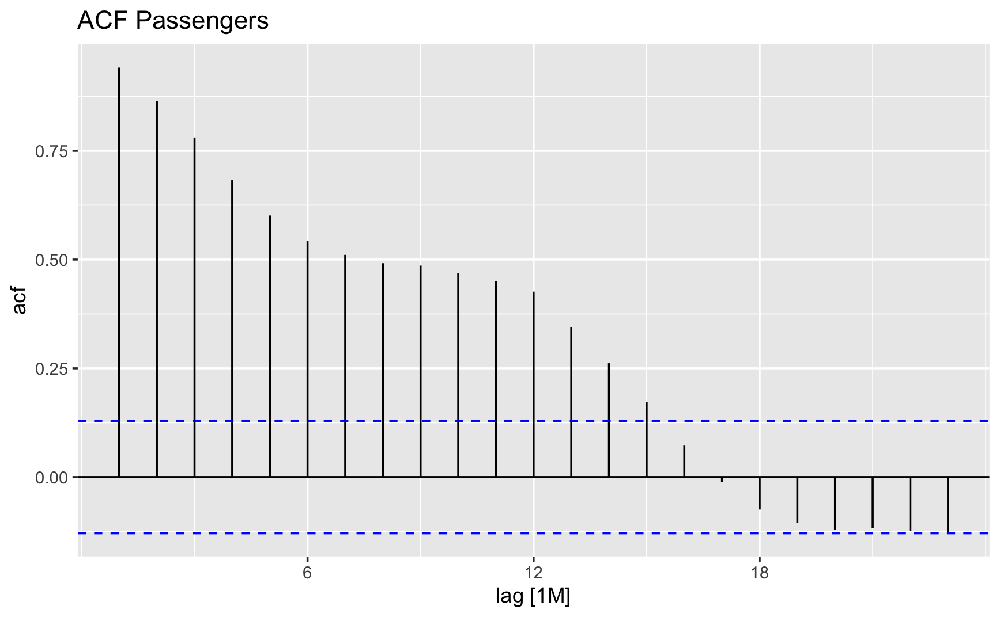
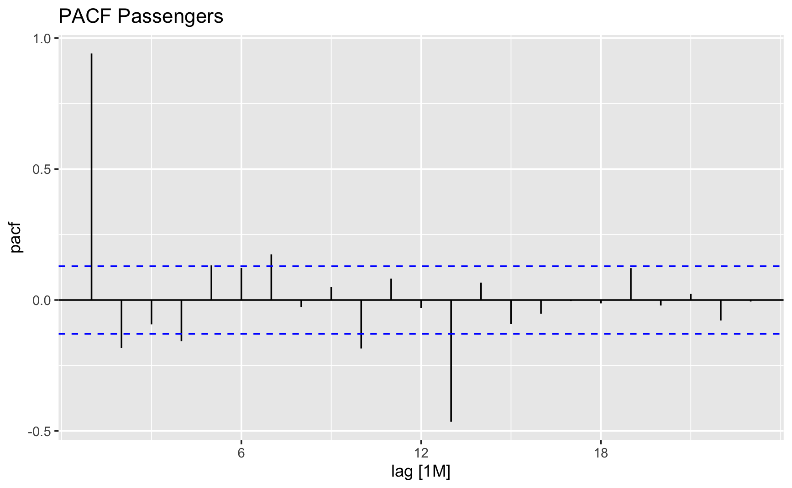
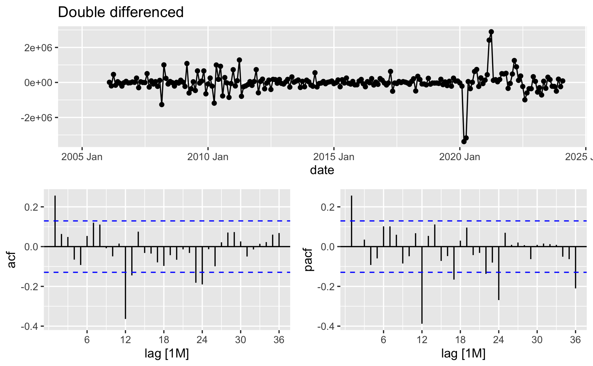
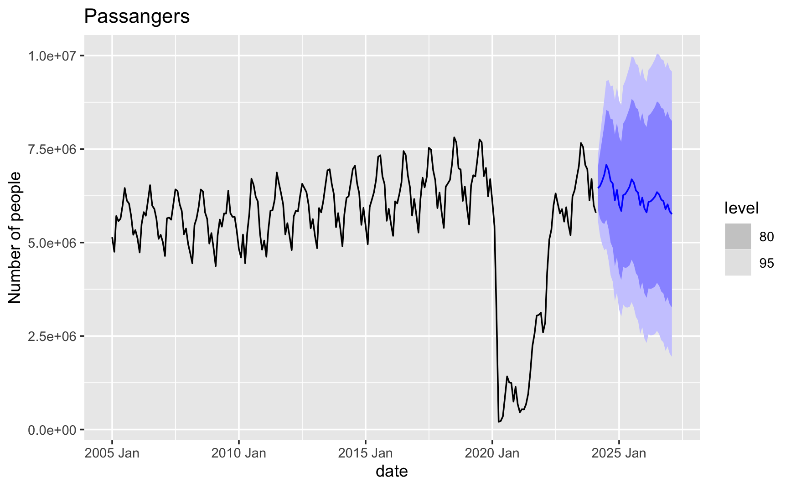
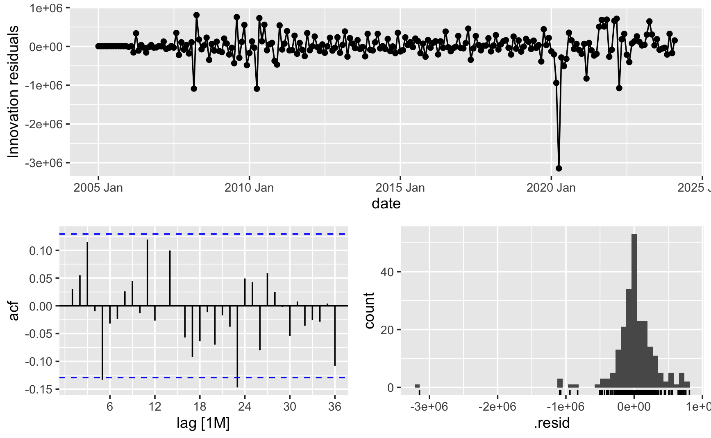
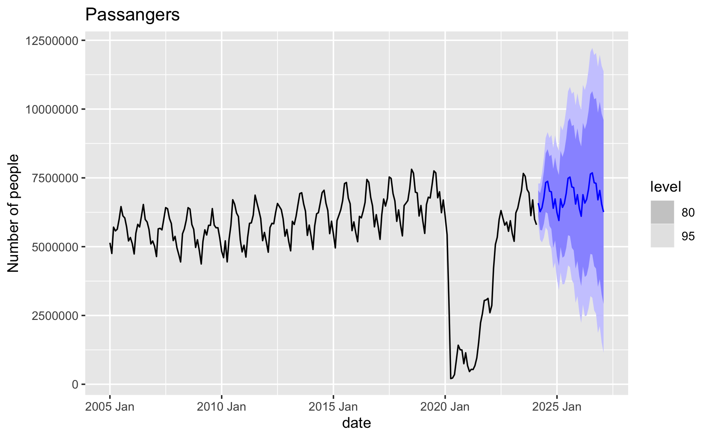

# Forecasting Heathrow Airport Passenger Traffic

Heathrow Airport, situated in London, England, is a pivotal international travel hub, catering to millions of passengers annually. To better anticipate future passenger traffic, historical data analysis is imperative. Examining past trends through a time series chart offers invaluable insights into the airport's traffic patterns. Leveraging resources from Rob Hyndman and utilizing the fable ARIMA model in R, we can effectively model and forecast passenger traffic. By incorporating known trends and seasonality factors, we aim to generate predictions that will maybe assist in optimizing airport operations and resource allocation to meet the demands of future travelers efficiently.

## A little bit about Heathrow Airport

- **Name**: Heathrow Airport
- **Former Name**: London Airport (until 1966)
- **Location**: London, England, United Kingdom
- **IATA Code**: LHR
- **ICAO Code**: EGLL
- **Ownership**:
  - Heathrow Airport Holdings
  - Majority owned by Ferrovial, Qatar Investment Authority, and CDPQ
- **International Rankings**:
  - Second-busiest airport in the world by international passenger traffic (2022)
  - Busiest airport in Europe (2023)
  - Airport with the most international connections (2023)
- **Development**:
  - Founded as a small airfield in 1929
  - Expanded significantly after World War II
  - Located 14 miles (23 kilometers) west of Central London
- **Size**:
  - Covers 4.74 square miles (12.3 square kilometers)
- **Infrastructure**:
  - Two parallel east–west runways
  - Four operational passenger terminals
  - One cargo terminal
- **Airlines**:
  - Primary hub for British Airways and Virgin Atlantic

```js
const long = await FileAttachment("data/08-long.csv").csv({
  typed: true,
});
```

## Here's a stacked line chart of the data

Data consists of the number of passengers at Heathrow Airport from 2001 to 2023, broken down by region. Then I uploaded the below chart to OpenAI's API to generate a short summary of the diagram.

"Based on the image you sent, it appears to be a graph about passenger traffic at various regions arriving at Heathrow Airport from 2005 to 2024. Here's what I can see about the trends:

Overall passenger traffic appears to be trending upwards from 2005 to 2019, with a significant drop in 2020 and 2021. Traffic appears to be recovering in 2022 but hasn't reached pre-pandemic levels.  Seasonal fluctuations exist in a yearly manner where it peaks in the middle of the year across all regions. Traffic from Europe seems to consistently make up the largest portion of passengers throughout the timeframe. Traffic from Asia/Pacific appears to be the second largest source and seems to be on an increasing trend. Traffic from North America appears to be on an increasing trend as well. Traffic from other regions appears to be fluctuating without a clear upward or downward trend.


According to a news article from January 15, 2024, Heathrow Airport had 79 million passengers in 2023, which is the third highest year on record. This suggests that passenger traffic has continued to recover in 2023.

Do you have any other questions about the image or trends in Heathrow Airport passenger traffic?..."

I think it did pretty well and picked up the main ideas of trend and seasonality in the data. However, it mistook Asia/Pacific as the second highest when it's supposed to be North America. Recognising trend and seasonality still is useful for our next step in forecasting the passenger traffic at Heathrow Airport.

```js
Plot.plot({
  marginLeft: 60,
  width: 1000,
  height: 700,
  y: {grid: true},
  color: {legend: true, scheme: "Accent"},
  marks: [
    Plot.areaY(long, {x: "Month", y: "Number of Passangers", fill: "Region", tip: true}),
    Plot.ruleY([0])
  ]
})
```

## Forecasting Passenger Traffic

We will be forecasting TOTAL passanger traffic (so all the regions combined). To forecast passenger traffic at Heathrow Airport, we will use the fable ARIMA model in R. The fable package is a collection of commonly used forecasting models that are easy to use and interpret. The ARIMA model is a popular choice for time series forecasting due to its ability to capture trends and seasonality in the data. By fitting an ARIMA model to the historical passenger traffic data, we can generate forecasts for future passenger traffic at Heathrow Airport.


### Zooming in 2 years of data to check seasonality
<figure>
  
  <figcaption></figcaption>
</figure>

Let's also check autocorrelation. Acf is the autocorrelation function, which measures the correlation between a time series and a lagged version of itself. The PACF is the partial autocorrelation function, which measures the correlation between a time series and a lagged version of itself after removing the effect of the intervening lags. These functions help us identify the order of the ARIMA model.

Below plots show that there is a strong seasonal component in the data, with peaks every 12 months. This suggests that we should use a seasonal ARIMA model to capture the seasonality in the data.

### Checking ACF
<figure>
  
  <figcaption></figcaption>
</figure>

### Checking PACF
<figure>
  
  <figcaption></figcaption>
</figure>

Ensuring stationarity in time series data is important for accurate forecasting models. Stationarity implies that the statistical properties of the data, such as mean and variance, remain constant over time. By differencing the data twice, we aim to stabilize its fluctuations and remove any trend or seasonality, thus achieving stationarity. This process enables us to build robust forecasting models that can better capture the underlying patterns and dynamics.


### Double Difference
<figure>
  
  <figcaption></figcaption>
</figure>

## Building the ARIMA Model
Our objective now is to identify a suitable ARIMA model based on the ACF and PACF analyses presented earlier. The significant spike observed at lag 1 in the ACF indicates a potential non-seasonal MA(1) component, while the spike at lag 12 suggests a seasonal MA(1) component. Consequently, we initialize with an ARIMA(0,1,1)(0,1,1) 12 model, incorporating first and seasonal differences, along with non-seasonal and seasonal MA(1) components. Alternatively, had we begun with the PACF, an ARIMA(1,1,0)(0,1,1) 12 model might have been selected, utilizing the PACF for the non-seasonal part and the ACF for the seasonal part. Additionally, we'll incorporate an automatically selected model.

```r
fit <- Passengers_ts |>
  model(
    arima011011 = ARIMA(value ~ pdq(0,1,1) + PDQ(0,1,1)),
    arima110011 = ARIMA(value ~ pdq(1,1,0) + PDQ(0,1,1)),
    auto = ARIMA(value, stepwise = FALSE, approx = FALSE)
  )
```

## Forecasting using the best model
We will now generate forecasts using the best model identified. The forecast horizon extends to 36 months, providing insights over the upcoming years. However, we see a strange forecast as it trends downwards with fit that is not ideal. 

This is due to covid-19 when travel restrictions were imposed, leading to a significant drop in passenger traffic. The model is unable to capture the sudden change in the data, resulting in a forecast that does not align with the actual data. This highlights the importance of considering external factors and events when building forecasting models.

Next, we include a dummy variable to account for the impact of covid-19 on passenger traffic. By incorporating this variable, we aim to improve the model's accuracy and generate more realistic forecasts that reflect the actual data trends.


### Forecast without dummy variable

<figure>
  
  <figcaption></figcaption>
</figure>

## Checking fit through residuals

To evaluate the model's performance, we examine the residuals, which represent the difference between the observed and predicted values. The residuals should ideally be random and normally distributed, indicating that the model captures the underlying patterns in the data effectively. By plotting the residuals, we can assess the model's fit and identify any potential issues or areas for improvement. We also fail to reject the null hypothesis of a Ljung-Box test for the residuals correlation, indicating that the model is a good fit for the data.

### Residuals plot
<figure>
  
  <figcaption></figcaption>
</figure>

Our final model looks so much better with the dummy variable included. The forecasted passenger traffic now aligns more closely with the actual data, capturing the impact of covid-19 on travel patterns. By incorporating external factors and adjusting the model accordingly, we can generate more accurate forecasts that reflect the real-world dynamics of passenger traffic at Heathrow Airport.

### Forecast with dummy variable

<figure>
  
  <figcaption></figcaption>
</figure>


```js
const fore = await FileAttachment("data/08-fore.csv").csv({
  typed: true,
});
```

## Forecasted Total Passenger Traffic 2024-2027 at Heathrow Airport

```js
view(Inputs.table(fore))
```

Data: Heathrow Airport, [here](https://www.heathrow.com/company/investor-centre/reports/traffic-statistics)
