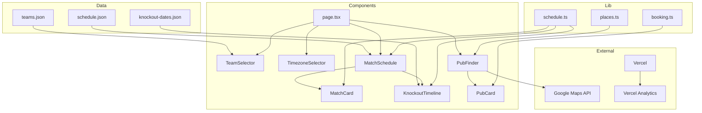
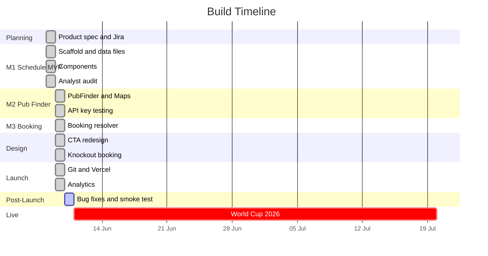
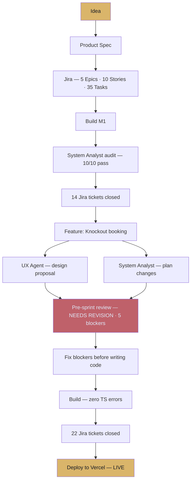

# World Cup Pub: From Idea to Live in 48 Hours

***Originally published as a build post-mortem on 09/06/2026. Live app: [world-cup-pub.vercel.app](https://world-cup-pub.vercel.app) · GitHub: [Npurnomo/World-Cup-Pub](https://github.com/Npurnomo/World-Cup-Pub)***

The 2026 FIFA World Cup kicks off on 11 June. On 8 June — three days before the opening match — the problem felt solvable: every England fan in London wants to watch the match at a pub, but finding one involves too many steps. Google it, find a pub, check if it shows the game, check if they take bookings. By the time you've done all that, the group chat has already moved on.

**The hypothesis:** get from "I want to watch England" to "I have a table booked" in under 60 seconds. If that's achievable, it's a product worth building.

**The constraint:** 48 hours.

---

## Why bother with docs when you're in a rush?

The instinct when time is short is to skip process and just build. This project deliberately did the opposite — and it paid off.

Before a single line of code, three things were created:

- A **product spec** (what the app does, the user journey, tech stack decisions, non-goals)
- A **technical scaffold** (file structure, TypeScript interfaces, utility functions)
- A **Jira project** with 5 epics, 10 stories, and 35 tasks

Documentation at the start forces decisions to be made explicitly rather than accidentally. Every decision you defer gets made at 2am when you're tired and surrounded by half-built components. Two specific decisions made in the spec saved hours later:

1. **No persistent state, no login.** This single non-goal eliminated an entire category of complexity.
2. **Match context is carried automatically.** The user selects a match once — that context flows into the pub finder without re-entry. This UX rule shaped the entire state machine from the start.

---

## The user journey

A linear 4-step flow, designed so the user provides information once at each step:

The team selection informs the schedule. The schedule selection informs the pub finder. The pub finder asks for one thing — location. No re-entry, no friction.

---

## Technical architecture

No server. All data is static JSON bundled at build time. Pure client-side React — no API routes, no database, no backend.

One notable decision: **discriminated union for `MatchContext`**. `isKnockout: false` for confirmed fixtures, `isKnockout: true` for knockout rounds. TypeScript enforces correctness at every call site. Designed before any component was written — types were correct from the first file.

---

## Build timeline

### M1 — Schedule MVP

The biggest challenge: data accuracy. The original `teams.json` contained Venezuela and Indonesia as qualifiers — neither qualified for the 2026 World Cup. England was placed in Group G (wrong) rather than Group L.

**Lesson:** never trust AI training data for live tournament facts. All fixture and team data was manually verified against Sky Sports and Wikipedia.

### M2 — Pub Finder

Google Maps surfaced two issues. First, the API key wasn't in `.env.local` — the app correctly showed a "key missing" screen rather than crashing. Second, Google requires billing to be enabled before Places and Geocoding APIs activate (the Maps JS API itself worked without billing). A £10 prepayment activated billing on the new UK account. Once live, a test returned 15 sport pubs near central London within 200ms.

### Feature pivot — Knockout pub booking

Mid-build: should users be able to book a pub for the knockout rounds, not just group stage matches? Yes. The implementation required a significant type change — from a flat `MatchContext` interface to the discriminated union described above. A system analyst review caught 5 blockers before the code was written. TypeScript compiled with 0 errors on the first attempt.

### CTA naming

The original CTA was "Watch at a pub". Changed to "Book a pub". The action the user is taking is _booking_, not watching. Three-file change, significant UX clarity.

---

## The agent workflow

The most valuable step was the pre-sprint review returning **NEEDS REVISION** with 5 blockers. Without it, those issues would have surfaced during coding — at 3× the cost in time. The review took 3 minutes.

---

## The launch

Getting from code to live took longer than the building itself — 5 infrastructure problems in sequence:

1. No git repository. The project had never been committed.
2. Wrong SSH account. Required a new key, host alias, and `IdentitiesOnly yes` in `~/.ssh/config`.
3. GitHub repo didn't exist. Push failed until the repo was created manually.
4. Google Maps billing not enabled. £10 prepayment required.
5. API key had no referrer restriction. Caught post-launch and fixed.

**Time from first `git init` to live URL: approximately 45 minutes.**

---

## Post-launch bugs

Two bugs found on day 2 — both caused by the same process failure: M3 was marked Done without a review, and the smoke test was never run.

### Bug 1 — Google Maps fallback URL broken

**Symptom:** "Book a table" on pubs without a website opened a broken Google Maps link.

**Root cause — two issues compounding:**
- `places.ts` used an unofficial URL format
- `booking.ts` ignored `pub.mapsUrl` entirely and rebuilt a near-identical broken URL from scratch — a DRY violation. The field existed but was never used.

**Fix:** `places.ts` now uses the official Google Maps URL API format. `booking.ts` simplified to `return pub.mapsUrl` — single source of truth.

### Bug 2 — Tap targets below 44px minimum

Mobile tap targets on two components were below Apple's 44px minimum:
- MatchCard button: `py-2.5` ≈ 34px → fixed to `py-3` = 44px
- KnockoutTimeline button: `py-1.5` ≈ 28px → fixed to `py-2.5` ≈ 40px

Both passed once fixed. The root cause: the mobile QA pass was scheduled but never run before launch.

### Smoke test results

Check | Result
--- | ---
"Book a table" opens in new tab | ✅ Pass
Input font sizes (iOS auto-zoom prevention) | ✅ Pass
`?forceKnockout=1` dev override | ✅ Pass
Zero-results state renders | ✅ Pass
Error state with retry renders | ✅ Pass
API key missing warning renders | ✅ Pass
MatchCard tap target ≥ 44px | ✅ Fixed (was 34px)
KnockoutTimeline tap target ≥ 44px | ✅ Fixed (was 28px)
Google Maps fallback URL | ✅ Fixed
Map tiles load on device | ⏳ Pending manual test
No horizontal overflow at 390px | ⏳ Pending manual test
Vercel Analytics recording | ⏳ Pending

---

## Key decisions

Decision | Chosen | Rejected | Why
--- | --- | --- | ---
Hosting | Vercel (hobby) | GitHub Pages | 5-min setup vs 30+ min; tournament in 2 days
Analytics | Vercel Web Analytics | Plausible, GA4 | Built-in, GDPR-compliant, zero setup, free
Maps loading | `next/script` | `@googlemaps/js-api-loader` | v2 dropped the Loader class mid-build
State | React useState, no persistence | localStorage, Zustand | Non-goal from day 1; eliminates entire complexity category
Booking | Pub website → Google Maps | DesignMyNight | No partner key; works for every pub
Data | Static JSON at build time | Live FIFA API | Schedule is fixed; instant load; zero cost
Domain | world-cup-pub.vercel.app | worldcup.pub ($32/yr) | Tournament is 6 weeks; free subdomain is sufficient

---

## The numbers

**Codebase:** 36 files · 8,581 lines · 8 React components · 4 lib utilities · 3 data files · 0 TypeScript errors throughout

**Process:** 57 Jira tickets · 3 Confluence pages before code · 4 system analyst reviews · 5 blockers caught pre-sprint · 3 bugs filed and closed · ~48 hours idea to live

---

## What I'd do differently

1. **System analyst review on every milestone, not just M1.** The discipline that made M1 solid was abandoned under deadline pressure — exactly when it matters most.
2. **Run the smoke test before sharing the URL.** The "Book a table" fallback was always broken for pubs without a website. A 10-minute device test would have caught it.
3. **Set up git on day one.** No version history during the build meant no rollback if something went wrong.
4. **Restrict the API key before going live.** Standard practice, skipped under pressure.
5. **Validate fixture data first.** The Venezuela/Indonesia bug was caught late. A data pass before M1 would have fixed it earlier.

## What worked really well

1. **Documentation before code.** TypeScript interfaces defined before any component was written. Types were correct from the first file.
2. **Agent reviews between milestones.** 5 blockers caught before the type change saved 2–3 hours of debugging.
3. **Ruthlessly small scope.** No accounts. No server. London only. Static data. The app shipped in 48 hours because it was designed to.
4. **The defensive "key missing" screen.** Rather than crashing when the API key was absent, a clear actionable card rendered. Made the billing setup far less painful.
5. **`?forceKnockout=1` dev override.** The conditional CTA is untestable until late June without this URL param.
