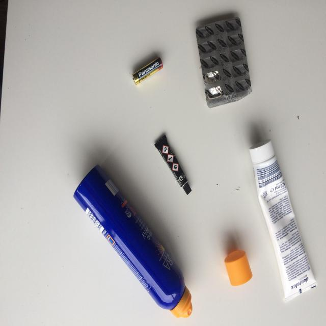
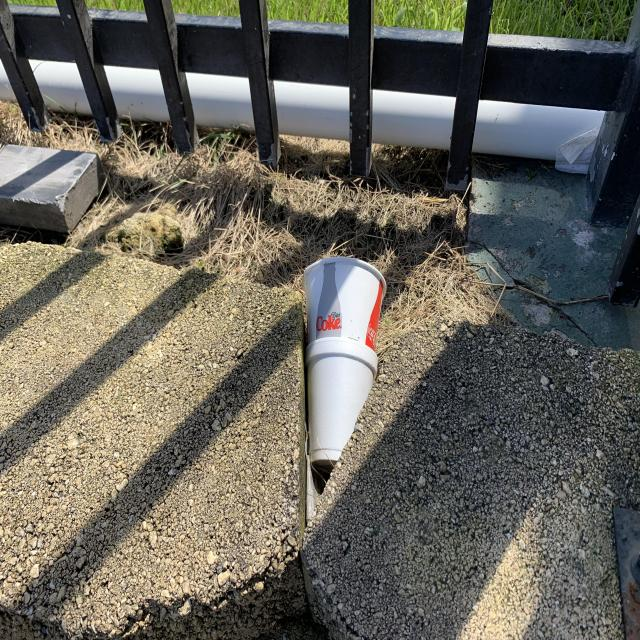
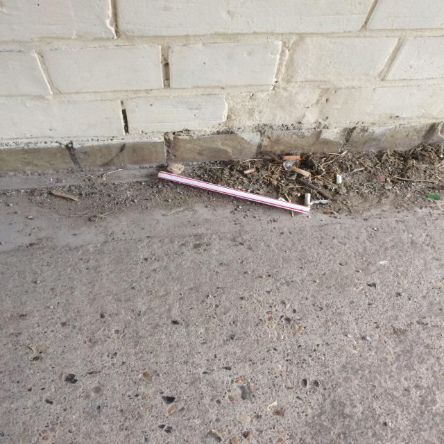
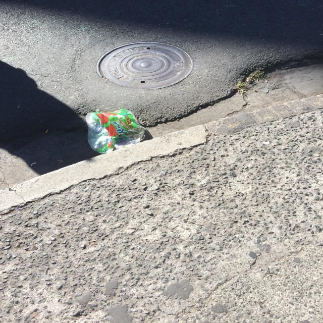

<style>
.qa-hero {max-width:800px;margin:3rem 0 2rem}
.qa-kicker {font:600 11px var(--monospace);letter-spacing:.15em;text-transform:uppercase;color:#c59546}
.qa-hero h1 {font-size:clamp(2.5rem,5vw,4.5rem);line-height:1.05;letter-spacing:-.04em;margin:.7rem 0 1rem}
.qa-hero p {font-size:1.15rem;line-height:1.65;color:var(--theme-foreground-muted)}
.qa-callout {border-left:4px solid #c59546;background:var(--theme-background-alt);padding:1.1rem 1.3rem;margin:1.5rem 0 2.3rem;line-height:1.6}
.qa-split {display:flex;height:36px;overflow:hidden;border-radius:5px;margin:1.2rem 0 .5rem;font:600 12px var(--monospace)}
.qa-split span {display:flex;align-items:center;padding:0 .7rem;white-space:nowrap}
.qa-split .train {flex:152;background:#7e5335;color:white}
.qa-split .valid {flex:20;background:#b98531;color:#161616}
.qa-split .test {flex:12;background:#d9bb76;color:#161616}
.qa-note {font-size:13px;color:var(--theme-foreground-muted);line-height:1.6}
.qa-stats {display:grid;grid-template-columns:repeat(4,minmax(0,1fr));gap:.75rem;margin:1.5rem 0 2.2rem}
.qa-stat {background:var(--theme-background-alt);border:1px solid var(--theme-foreground-faintest);border-radius:8px;padding:1.15rem}
.qa-stat b {display:block;font:700 clamp(1.5rem,2.5vw,2rem) var(--sans-serif);color:var(--theme-foreground-focus)}
.qa-stat span {display:block;font:11px var(--monospace);color:var(--theme-foreground-muted);line-height:1.45;margin-top:.3rem}
.qa-matrix {width:100%;border-collapse:separate;border-spacing:8px;margin:1.2rem 0}
.qa-matrix th {text-align:left;font:600 11px var(--monospace);color:var(--theme-foreground-muted);padding:.45rem}
.qa-matrix td {width:50%;padding:1.2rem;border:1px solid var(--theme-foreground-faintest);border-radius:8px;background:var(--theme-background-alt);vertical-align:top}
.qa-matrix td b {display:block;font-size:2rem;line-height:1.1}
.qa-matrix td span {font-size:12px;color:var(--theme-foreground-muted)}
.qa-matrix .watch {border-color:#b98531}.qa-matrix .miss {border-color:#c35a50}
.qa-matrix .watch b {color:#b98531}.qa-matrix .miss b {color:#c35a50}
.qa-traces {display:grid;grid-template-columns:repeat(2,minmax(0,1fr));gap:1rem;margin:1.5rem 0 2rem}
.qa-traces figure {margin:0;background:var(--theme-background-alt);border:1px solid var(--theme-foreground-faintest);border-radius:8px;overflow:hidden}
.qa-traces img {width:100%;aspect-ratio:16/10;object-fit:cover;display:block}
.qa-traces figcaption {padding:1rem 1.1rem;font-size:13px;line-height:1.55}
.qa-traces figcaption b {display:block;font-size:14px;color:var(--theme-foreground-focus);margin:.25rem 0}
.qa-rule {font:600 11px var(--monospace);color:#b98531;text-transform:uppercase;letter-spacing:.08em}
.qa-judge {display:grid;grid-template-columns:repeat(3,1fr);gap:.75rem;margin:1.1rem 0 1.5rem}
.qa-judge div {padding:1rem;background:var(--theme-background-alt);border:1px solid var(--theme-foreground-faintest);border-radius:8px}
.qa-judge b {display:block;font-size:1.6rem}.qa-judge span {font:11px var(--monospace);color:var(--theme-foreground-muted)}
@media(max-width:700px){.qa-stats,.qa-judge{grid-template-columns:repeat(2,minmax(0,1fr))}.qa-traces{grid-template-columns:1fr}.qa-matrix td{padding:.8rem}.qa-matrix td b{font-size:1.5rem}.qa-split span{font-size:10px;padding:0 .35rem}}
</style>

<div class="qa-hero">
  <span class="qa-kicker">Quorum / run 6 / evidence lab</span>
  <h1>A correct answer can take the wrong route.</h1>
  <p>Quorum routed 184 hand-verified recycling images through a detector, a vision-language model, and a human queue. The interesting result is which path produced each answer, and whether the evaluation data can support the claim.</p>
</div>

<div class="qa-callout"><strong>The result that changed the story:</strong> 40 decisions got the verdict right while taking the wrong route. Of those, 34 hard or out-of-distribution items were auto-decided when their reference route called for escalation. Another 6 easy items were escalated unnecessarily. Accuracy alone counts all 40 as wins.</div>

## First, inspect the evaluation set

The 184 labels were checked by hand. That makes the labels more credible; it does not make the images independent of the detector. This set was selected from the same TACO version 15 export used by the hosted detector. Most rows come from that export's <em>train</em> split.

<div class="qa-split" role="img" aria-label="Of 184 cases, 152 are train, 20 validation, and 12 test">
  <span class="train">152 train</span><span class="valid">20 valid</span><span class="test">12 test</span>
</div>
<p class="qa-note">82.6% train · 10.9% valid · 6.5% test</p>

The full set scored <strong>124/184 correct (67.4%)</strong>. The valid and test rows scored <strong>17/32 (53.1%)</strong>. Those 32 rows are too few to establish a reliable performance gap, and split labels alone do not prove there are no related images across splits. I have not verified the hosted checkpoint's training lineage. The 184-item result is a useful <em>pipeline diagnostic</em>, not an independent estimate of real-world accuracy. The set was deliberately stratified, so its class mix also differs from a live recycling stream.

```js
const audit = await FileAttachment("data/quorum-audit-run-6.json").json();
const cohortNames = {
  all: "All 184 verified cases",
  nontrain: "Valid + test (32)",
  train: "Train (152)",
  valid: "Valid only (20)",
  test: "Test only (12)"
};
const cohort = view(Inputs.select(Object.keys(cohortNames), {
  label: "Inspect a dataset slice",
  value: "all",
  format: d => cohortNames[d]
}));
```

```js
const stats = audit.cohorts[cohort];
const cases = audit.cases.filter(d =>
  cohort === "all" ||
  (cohort === "nontrain" ? d.split !== "train" : d.split === cohort)
);
const pct = value => (100 * value).toFixed(1) + "%";
```

<div class="qa-stats">
  <div class="qa-stat"><b>${stats.correct + " / " + stats.n}</b><span>${"correct verdicts · " + pct(stats.accuracy)}</span></div>
  <div class="qa-stat"><b>${pct(stats.routing_recall)}</b><span>hard items escalated · routing recall</span></div>
  <div class="qa-stat"><b>${pct(stats.routing_precision)}</b><span>escalations genuinely hard · routing precision</span></div>
  <div class="qa-stat"><b>${stats.false_negatives}</b><span>contaminants missed or left without a verdict</span></div>
</div>

## Route × verdict: four kinds of outcome

The reference route is <em>escalate</em> for hard and out-of-distribution items and <em>auto</em> for easy items. Routing quality is separate from whether the final verdict matches the true label. A pending human decision counts as an attempted decision without a correct verdict.

<table class="qa-matrix">
  <thead><tr><th></th><th>Verdict right</th><th>Verdict wrong or pending</th></tr></thead>
  <tbody>
    <tr><th>Route right</th>
      <td><b>${stats.route_verdict_grid.route_right_verdict_right}</b><span>Working as intended</span></td>
      <td class="miss"><b>${stats.route_verdict_grid.route_right_verdict_wrong}</b><span>The chosen path still failed</span></td>
    </tr>
    <tr><th>Route wrong</th>
      <td class="watch"><b>${stats.route_verdict_grid.route_wrong_verdict_right}</b><span>Correct outcome, fragile process</span></td>
      <td class="miss"><b>${stats.route_verdict_grid.route_wrong_verdict_wrong}</b><span>Both routing and outcome failed</span></td>
    </tr>
  </tbody>
</table>

<p class="qa-note">Counts change with the dataset slice. For all 184 cases, the cells are 84 / 40 / 40 / 20. A wrong route with a right verdict can be a risky auto-decision or a needless escalation; the case list shows which.</p>

```js
const cellNames = {
  route_wrong_verdict_right: "Verdict right · route wrong",
  route_wrong_verdict_wrong: "Verdict wrong · route wrong",
  route_right_verdict_wrong: "Verdict wrong · route right",
  route_right_verdict_right: "Verdict right · route right"
};
const cell = view(Inputs.select(Object.keys(cellNames), {
  label: "Inspect a matrix cell",
  value: "route_wrong_verdict_right",
  format: d => cellNames[d]
}));
```

```js
const cellKey = d => "route_" + (d.route_correct ? "right" : "wrong") +
  "_verdict_" + (d.verdict_correct ? "right" : "wrong");
const inspected = cases.filter(d => cellKey(d) === cell).map(d => ({
  "Case": "#" + d.id,
  "Split": d.split,
  "Tier": d.tier,
  "True label": d.truth,
  "Expected route": d.expected_route,
  "Actual route": d.route,
  "Gate rule": d.gate_rule,
  "Detector top label": d.top_label
    ? d.top_label + " (" + (100 * d.top_confidence).toFixed(0) + "%)"
    : "no detection",
  "Final verdict": d.verdict ?? "pending / no verdict"
}));
```

${Inputs.table(inspected, {rows: 8})}

### Four traces from the valid split

<div class="qa-traces">
  <figure><figcaption><span class="qa-rule">Route wrong · verdict right</span><b>Case #23 — a battery got the right verdict by the wrong path</b>The out-of-distribution item was meant to escalate. The gate auto-decided contaminated.</figcaption></figure>
  <figure><figcaption><span class="qa-rule">Route wrong · verdict wrong</span><b>Case #48 — two failures on one image</b>This hard, contaminated item was auto-decided clean. It never reached the adjudicator or a reviewer.</figcaption></figure>
  <figure><figcaption><span class="qa-rule">Route right · verdict right</span><b>Case #31 — escalation earned its place</b>The gate escalated a hard item and the downstream verdict matched the verified contaminant label.</figcaption></figure>
  <figure><figcaption><span class="qa-rule">Route right · verdict wrong</span><b>Case #34 — a good route was not enough</b>The gate escalated this hard item, but the final verdict was clean against a verified contaminated label.</figcaption></figure>
</div>

Images: [TACO dataset](https://github.com/pedropro/TACO), by Pedro F. Proença and Pedro Simões, via the [Roboflow TACO v15 export](https://universe.roboflow.com/mohamed-traore-2ekkp/taco-trash-annotations-in-context), [CC BY 4.0](https://creativecommons.org/licenses/by/4.0/). Image paths, hashes, and rationale text are excluded from the public data snapshot.

## The evaluator needed an eval too

The local text-only judge scored adjudicator rationales. A blind, 30-item human calibration returned:

<div class="qa-judge">
  <div><b>30</b><span>human-scored rationales</span></div>
  <div><b>0.259</b><span>weighted Cohen's κ</span></div>
  <div><b>60%</b><span>exact agreement</span></div>
</div>

The trust bar was κ ≥ 0.6, set before scoring. The judge is therefore <strong>not trusted</strong>. It reads only text, so fluent descriptions of objects absent from the photograph can look grounded. The next experiment needs a vision-capable judge and a fresh blind calibration; rewriting the text rubric alone did not clear the bar.

## What I would change next

1. **Build a new, source-disjoint golden slice.** Keep run 6 frozen and version the new set. Record source provenance and check visual near-duplicates before evaluating.
2. **Separate detector, router, and adjudicator claims.** Report each on the same pinned slice and threshold version. A stronger verdict stage cannot compensate for a gate that confidently sends hard items away from it.
3. **Only then revisit the economics dial.** The current frontier assumes downstream quality measured on this set. A broader threshold sweep on the same 184 images cannot repair the evaluation's independence problem.

This read-only audit uses recorded decisions from [Quorum's case study](./11-Quorum), eval run 6, threshold version 2, and commit `1d770b5a21b4`. Changing the slice makes no model calls and changes no Quorum state.
